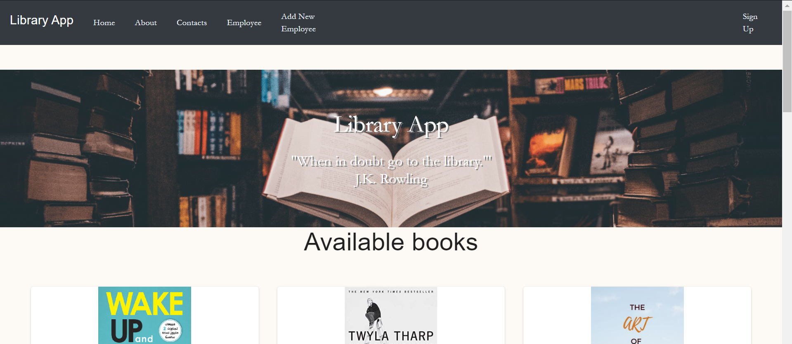
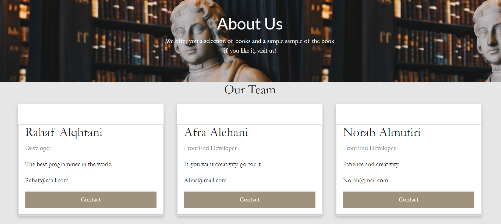
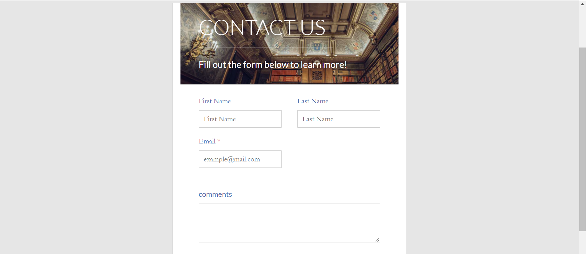
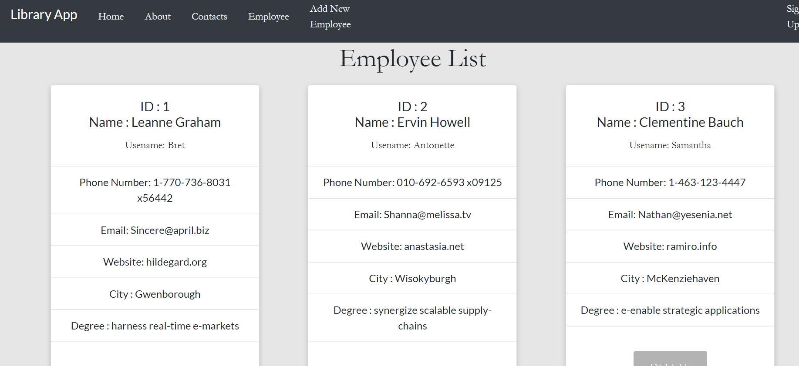
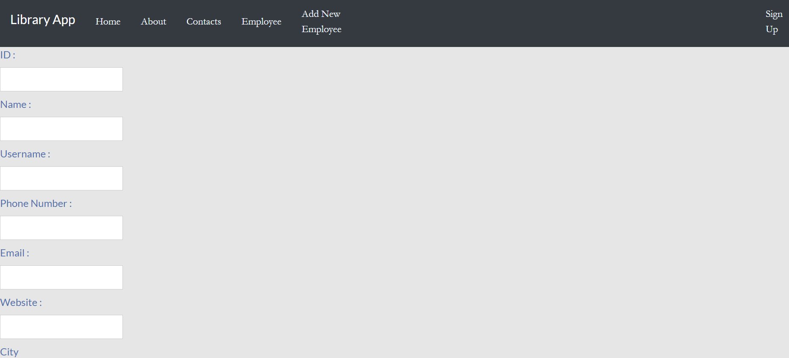

#  Book Store

 ## Idea of project :
 Website application display books,applid CRUD operations were implemented in backward places in the project, where dispalay library staff information and can be modified and deleted,also used Third-Party Authentication login through Facebook.This application was built React freamwork as front-ends and JavaScript as back-ends.

 

 

## Screenshot
>home page 

>About page 

>Contact page 

>Employee page 

>home page 

### Set up  
### Prerequisites
- Visual Studio Code 

### Set up  
 #### react Library 
 #### facebook Authentication
 #### axios Library
 

### Front-End  
 - HTML
 - CSS
 - JS
 - Bootstrap 
 - Material UI
### Back-End 
 - Java Script
 - axios
 
 

### Author
Taif Bin Eid
### License & Resource
https://material-ui.com/  
https://getbootstrap.com/  
https://unsplash.com/  
https://jsonplaceholder.typicode.com/

